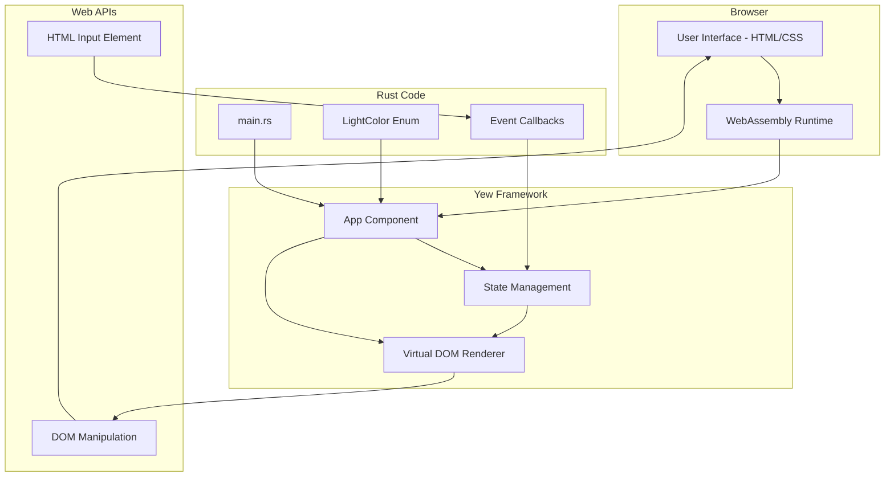
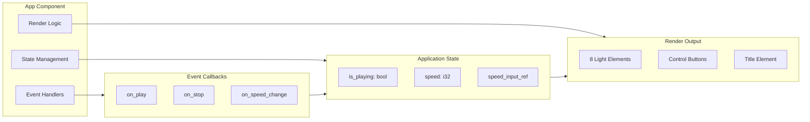
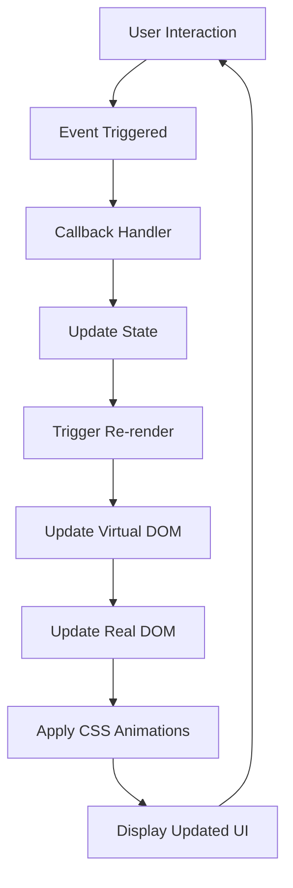
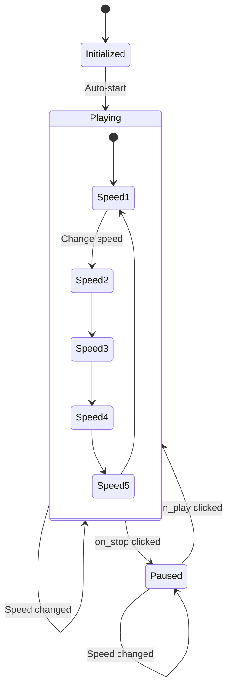
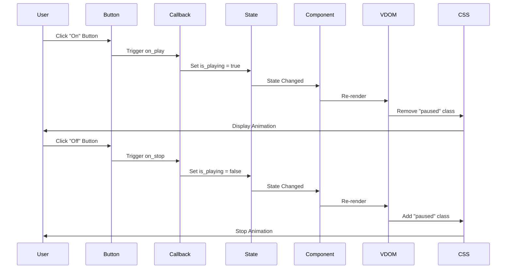
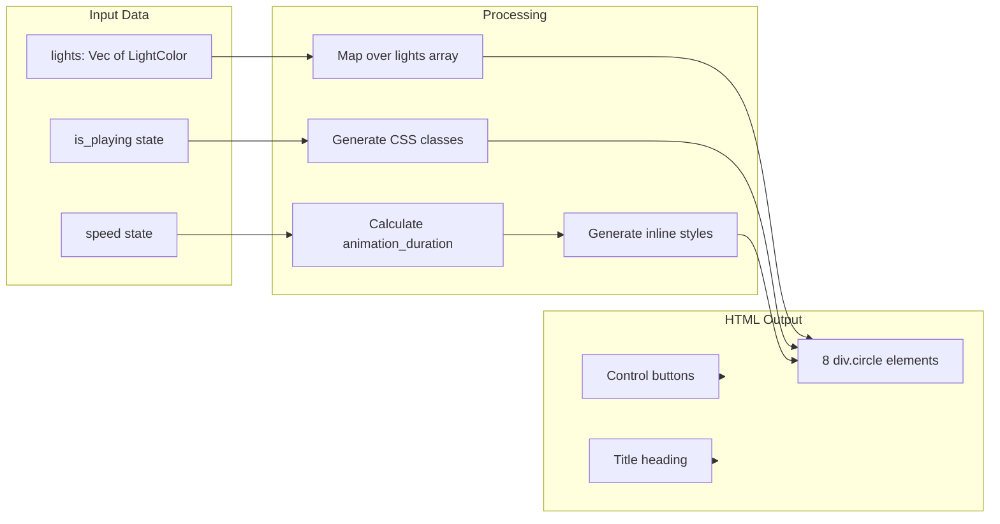
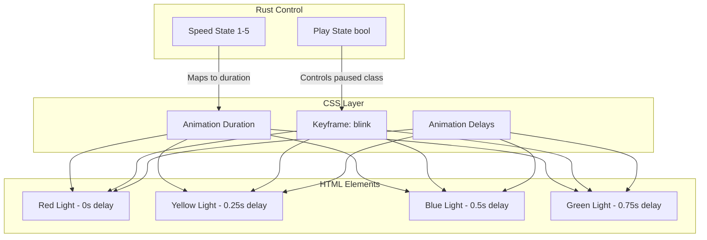
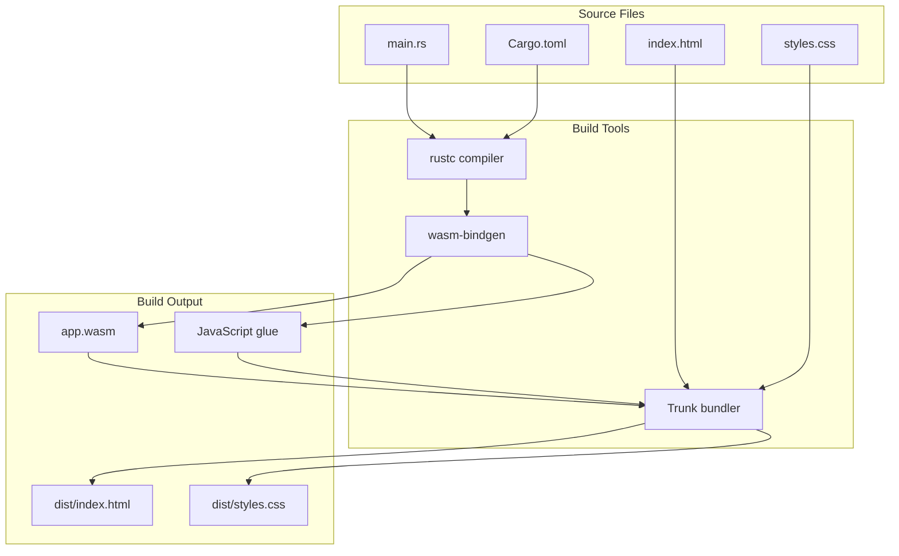

# Architecture

This page provides a comprehensive overview of the xmas-rs architecture, including system design, component relationships, and data flow.

## System Architecture Overview

The xmas-rs application follows a clean, layered architecture built on the Yew framework's component-based model.

### High-Level Architecture

### Component Architecture

## Data Flow Architecture

The application follows a unidirectional data flow pattern:

### State Management Flow

## Layer Architecture

### Presentation Layer

The presentation layer consists of:

- **HTML Structure** (`index.html`): Minimal shell for mounting the Yew app
- **CSS Styling** (`styles.css`): Visual styling, animations, and effects
- **Dynamic HTML**: Generated by Yew's virtual DOM

### Application Layer

The application layer (`src/main.rs`) contains:

1. **Component Definition**: `App` function component
2. **State Management**: React-style hooks (`use_state`, `use_node_ref`)
3. **Event Handling**: Callback creation and state updates
4. **Business Logic**: Animation speed calculations

### Data Layer

The data layer includes:

- **LightColor Enum**: Type-safe color representation
- **State Variables**: Runtime application state
- **Constants**: Light pattern array (8 lights)

## Component Interaction Diagram

## Rendering Pipeline

## Animation Architecture

The animation system uses CSS keyframes with dynamic control:

## Build Architecture

## Design Patterns

### Component Pattern

The application uses Yew's functional component pattern:

- **Function Components**: Stateless function that returns HTML
- **Hooks**: React-style hooks for state management
- **Props**: None (single component app)

### Observer Pattern

State changes automatically trigger re-renders:

- State changes → Component re-evaluation → Virtual DOM update → Real DOM patch

### Strategy Pattern

Animation speed is determined by a strategy pattern:

- Speed value (1-5) maps to duration string
- Implemented via match expression
- Easily extensible for new speeds

## Security Considerations

### Input Validation

- Speed input is validated to range 1-5
- Type checking ensures i32 parsing
- Invalid inputs are silently ignored

### Memory Safety

- Rust's ownership system prevents memory leaks
- No unsafe code blocks
- WASM sandbox provides additional isolation

---

**Related Pages**:
- [[Component-Details]] - Deep dive into each component
- [[Build-and-Deployment]] - Build process details
- [[Home]] - Return to overview
