# Build and Deployment

This page covers the complete build and deployment process for xmas-rs, including toolchain setup, build workflows, and deployment strategies.

## Table of Contents

- [Prerequisites](#prerequisites)
- [Build System](#build-system)
- [Build Process](#build-process)
- [Development Workflow](#development-workflow)
- [Production Build](#production-build)
- [Deployment](#deployment)

---

## Prerequisites

### Required Tools

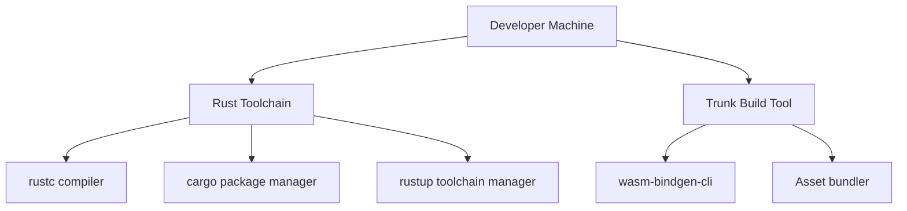

### Installation Steps

#### 1. Rust Toolchain

```bash
# Install Rust via rustup (if not already installed)
curl --proto '=https' --tlsv1.2 -sSf https://sh.rustup.rs | sh

# Verify installation
rustc --version
cargo --version
```

#### 2. WebAssembly Target

```bash
# Add wasm32-unknown-unknown target
rustup target add wasm32-unknown-unknown

# Verify target is installed
rustup target list | grep wasm32
```

#### 3. Trunk Build Tool

```bash
# Install trunk
cargo install --locked trunk

# Verify installation
trunk --version
```

### Installation Sequence

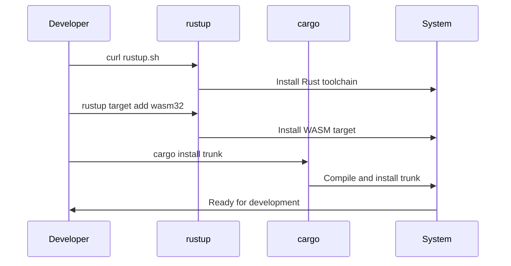

---

## Build System

### Build Tools Overview

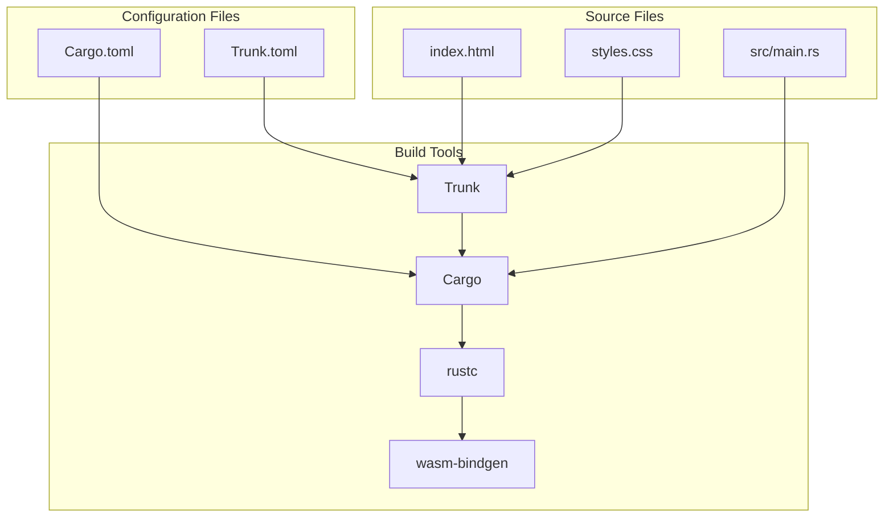

### Cargo Configuration

**File**: `Cargo.toml`

```toml
[package]
name = "xmas-rs"
version = "0.1.0"
edition = "2021"

[dependencies]
yew = { version = "0.21", features = ["csr"] }
wasm-bindgen = "0.2"
web-sys = { version = "0.3", features = ["HtmlInputElement"] }
gloo-timers = "0.3"
```

**Key Points**:
- **Edition 2021**: Uses latest Rust language features
- **Yew with CSR**: Client-side rendering feature enabled
- **web-sys features**: Only includes `HtmlInputElement` (minimal bloat)

### Trunk Configuration

**File**: `Trunk.toml`

```toml
[[hooks]]
stage = "build"
command = "sh"
command_arguments = ["-c", "echo 'Building Yew Christmas Lights app...'"]

[build]
target = "index.html"

[watch]
ignore = ["dist"]

[serve]
port = 8080
address = "127.0.0.1"
```

**Configuration Details**:
- **Build target**: `index.html` (entry point)
- **Watch ignore**: Prevents infinite rebuild loops
- **Serve settings**: Local development server on port 8080

---

## Build Process

### Compilation Pipeline

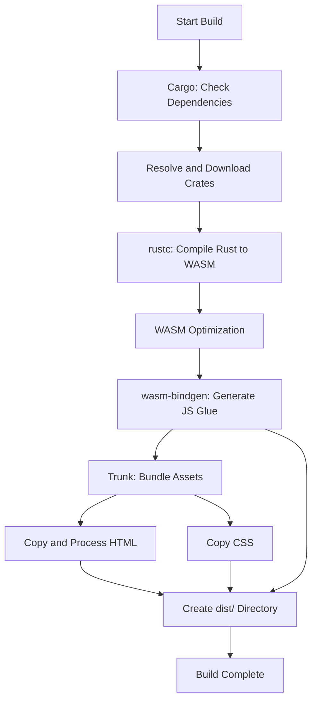

### Detailed Build Sequence

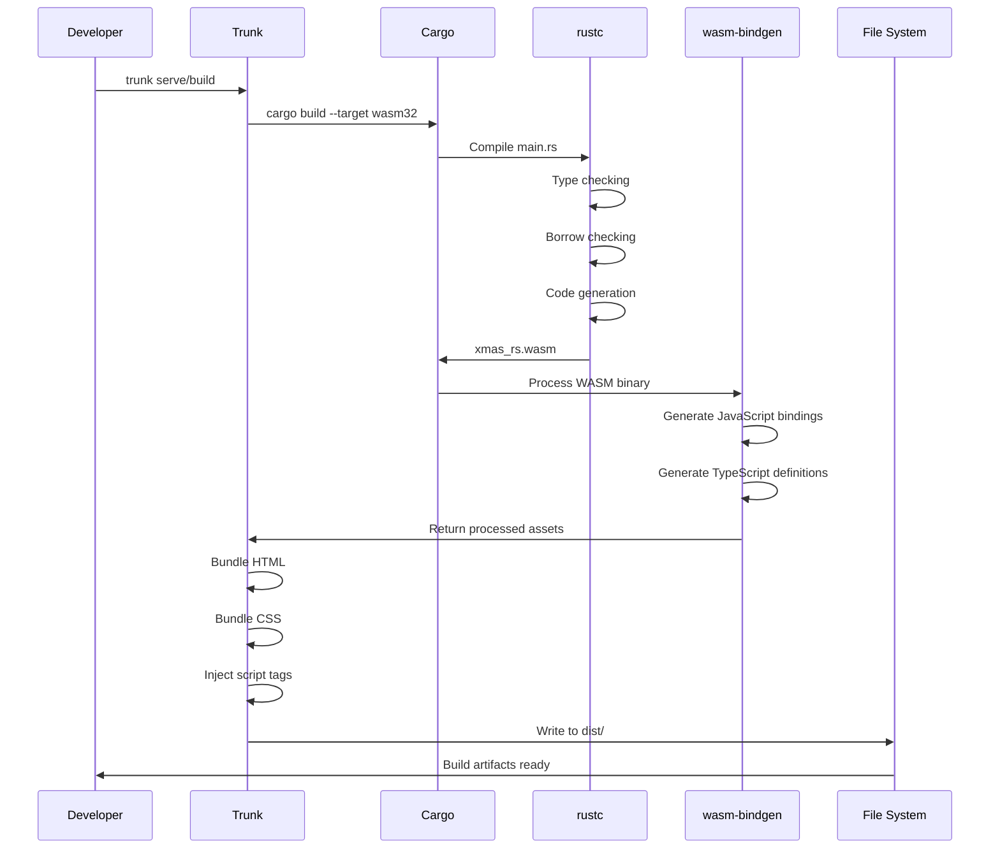

### Build Artifacts

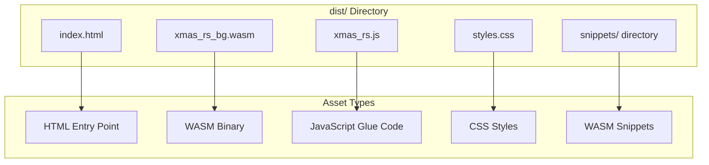

---

## Development Workflow

### Development Server

```bash
trunk serve
```

**Process**:

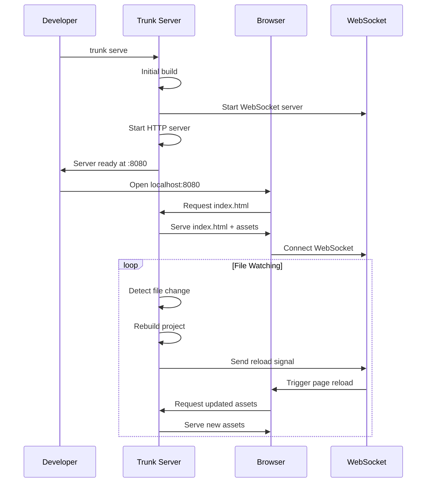

### Hot Reload Mechanism

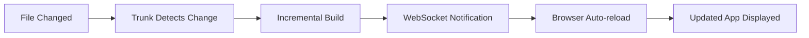

### Development Cycle

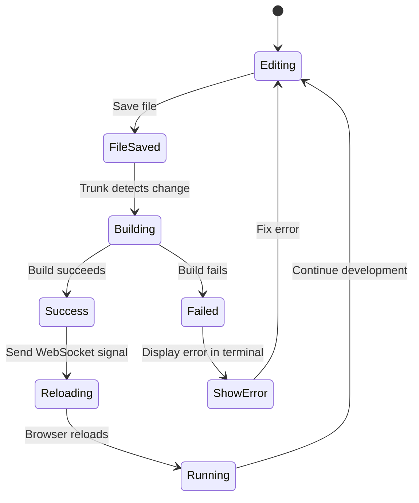

---

## Production Build

### Release Build Command

```bash
trunk build --release
```

### Release Build Optimizations

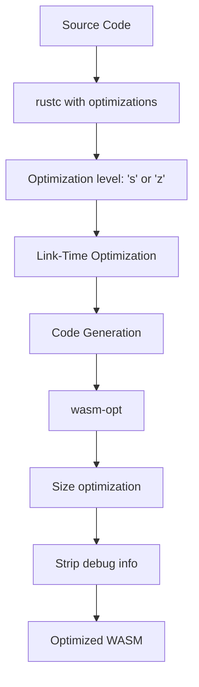

### Release Build Sequence

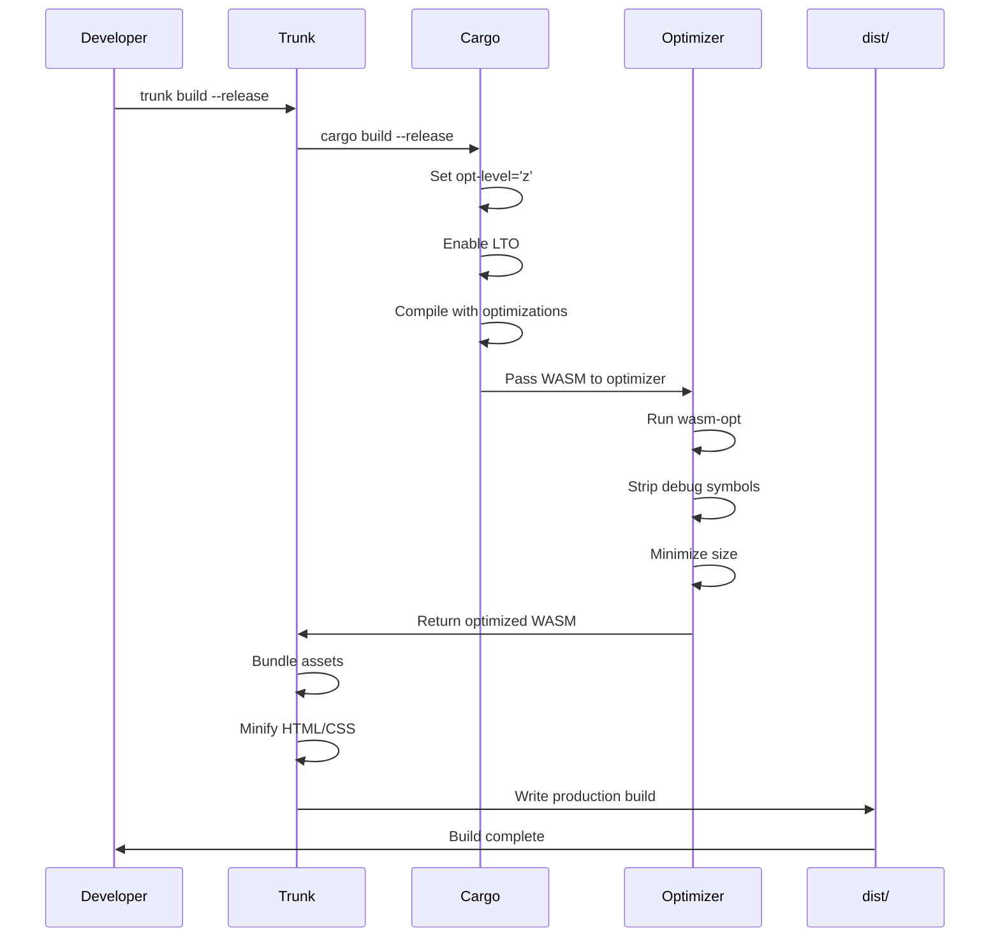

### Build Size Comparison

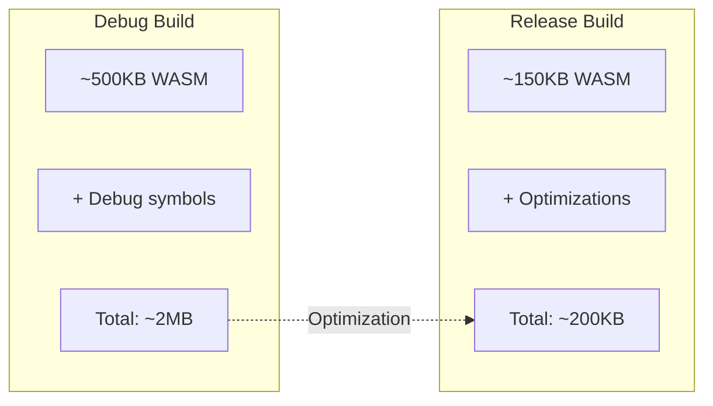

---

## Deployment

### Deployment Options

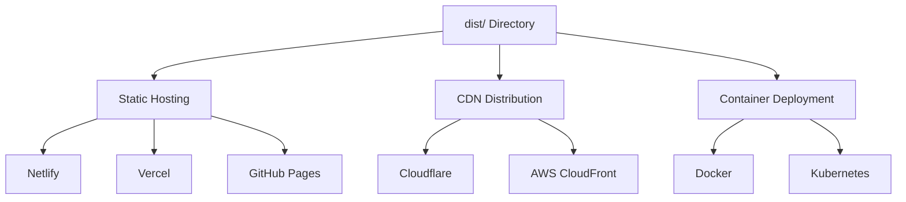

### GitHub Pages Deployment

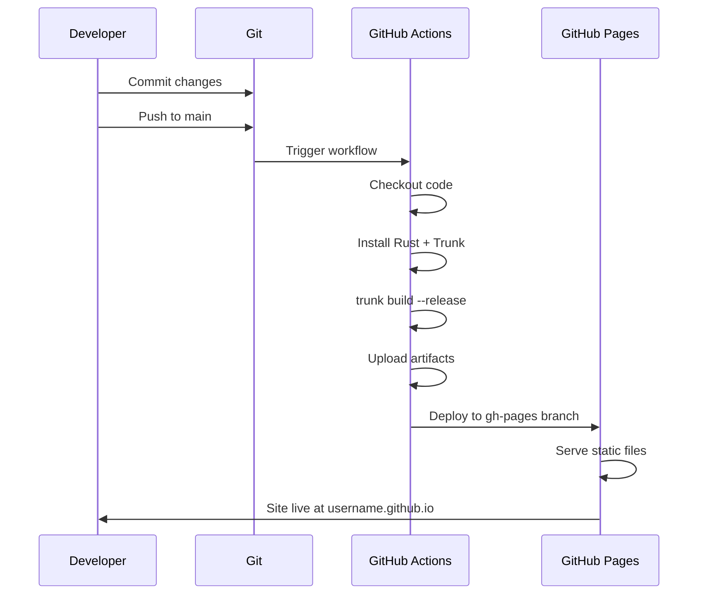

### Static File Server Deployment

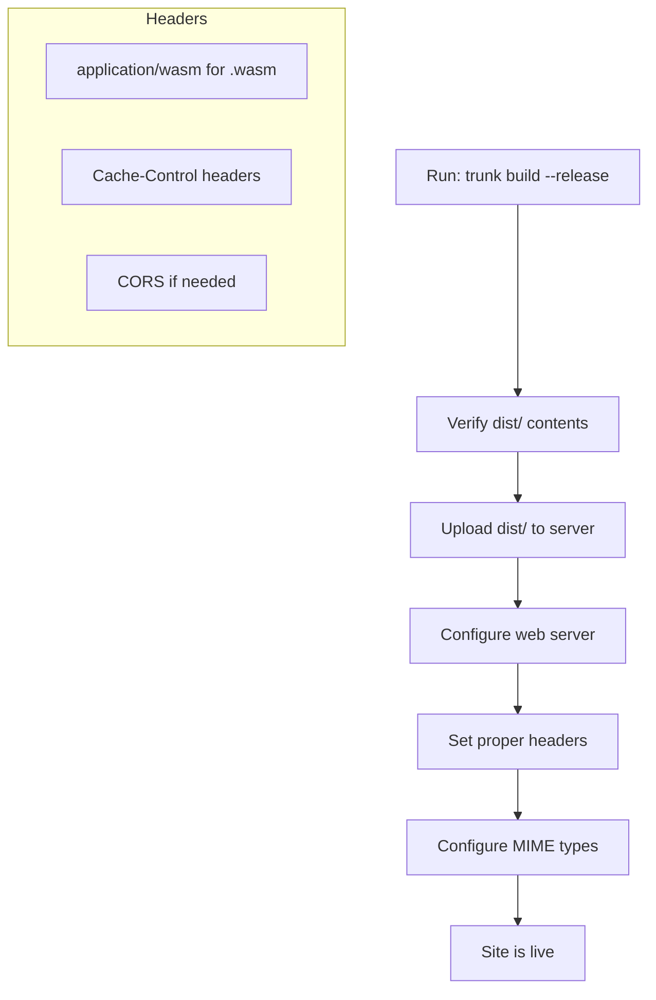

### Docker Deployment

**Dockerfile** example:

```dockerfile
FROM nginx:alpine
COPY dist/ /usr/share/nginx/html/
EXPOSE 80
```

**Deployment sequence**:

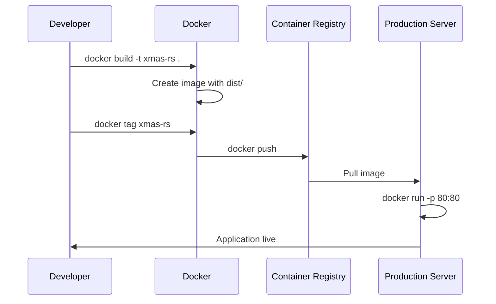

---

## Continuous Integration

### CI Pipeline

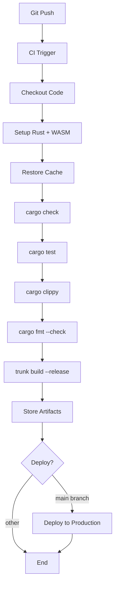

### CI/CD Workflow

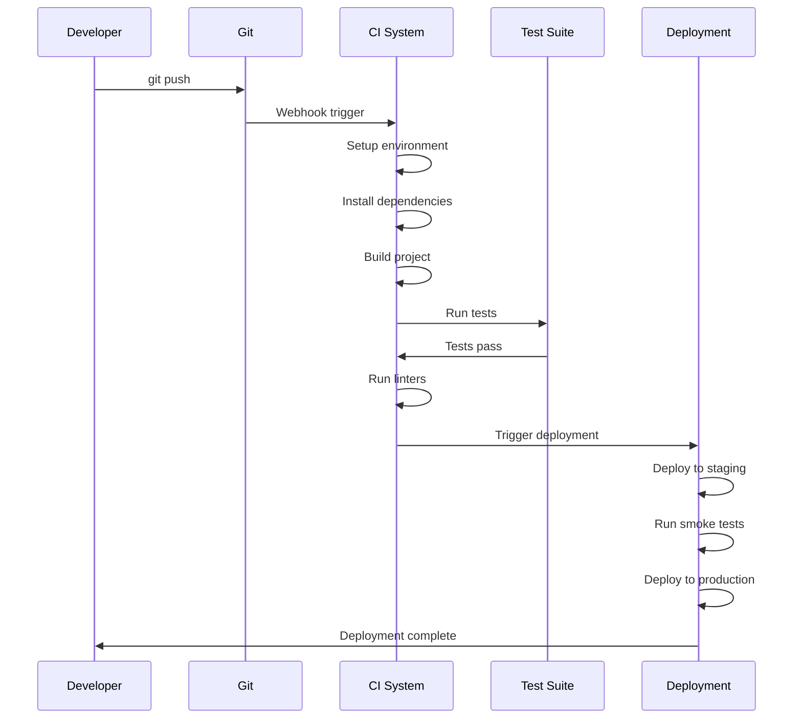

---

## Troubleshooting

### Common Build Issues

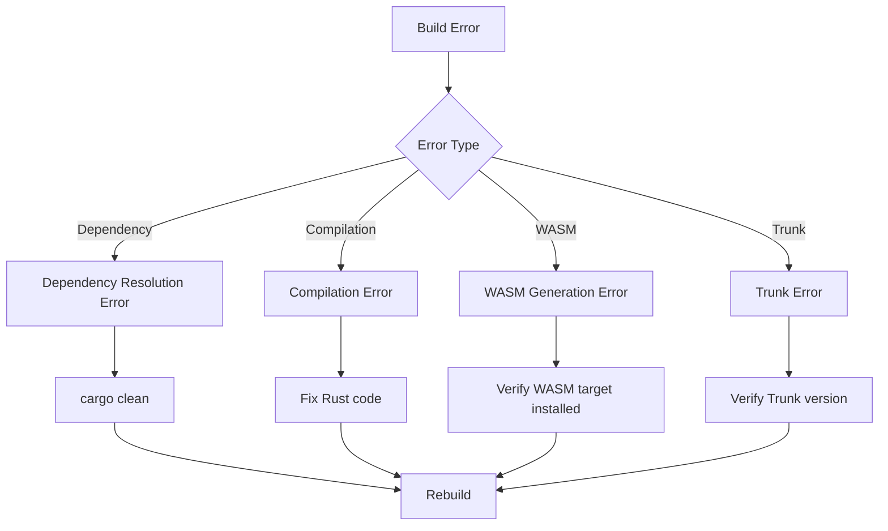

### Debug vs Release Differences

| Aspect | Debug Build | Release Build |
|--------|-------------|---------------|
| Optimization | None (fast compile) | Maximum (slow compile) |
| Size | ~2MB | ~200KB |
| Debug info | Included | Stripped |
| Source maps | Generated | Optional |
| Performance | Slower runtime | Faster runtime |
| Build time | ~10s | ~60s |

---

## Performance Metrics

### Build Time Breakdown

```mermaid
gantt
    title Build Process Timeline
    dateFormat X
    axisFormat %S

    section Cargo
    Dependency resolution: 0, 5s
    Compilation: 5s, 20s

    section WASM
    Code generation: 20s, 25s
    wasm-bindgen: 25s, 30s

    section Trunk
    Asset bundling: 30s, 32s
    File copying: 32s, 33s
```

### Resource Usage

```mermaid
graph TB
    subgraph BuildResources[Build Resources]
        CPU[CPU: 4 cores, 100% utilization]
        RAM[RAM: ~2GB peak]
        DISK[Disk: ~500MB cache]
        TIME[Time: ~30-60s release build]
    end

    subgraph RuntimeResources[Runtime Resources]
        WASM_SIZE[WASM: ~150KB]
        JS_SIZE[JS: ~50KB]
        CSS_SIZE[CSS: ~2KB]
        TOTAL[Total: ~200KB]
    end
```

---

**Related Pages**:
- [[Architecture]] - System architecture overview
- [[Component-Details]] - Component implementation details
- [[Home]] - Return to wiki home
