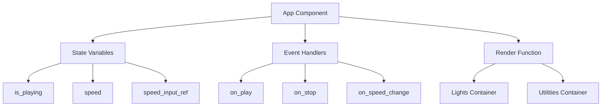
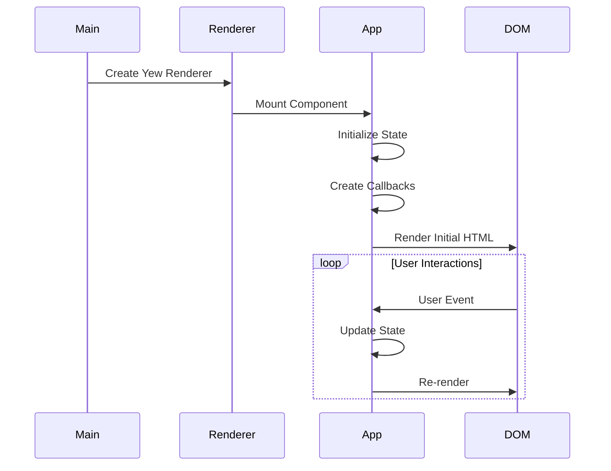
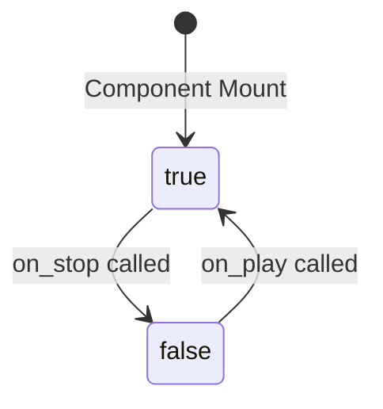
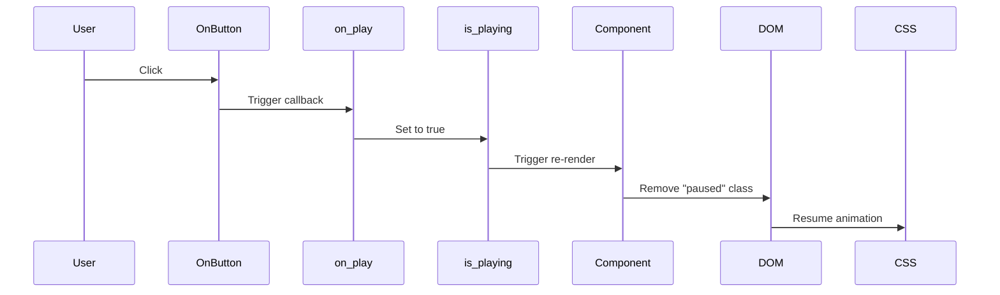
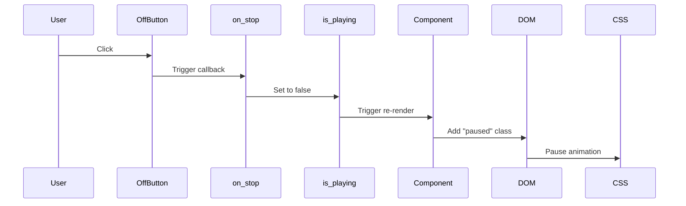
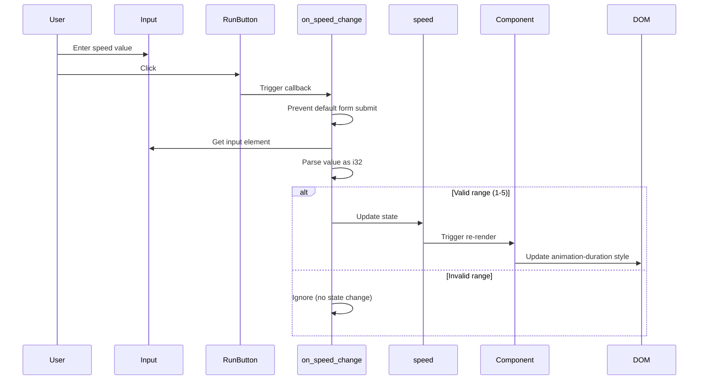
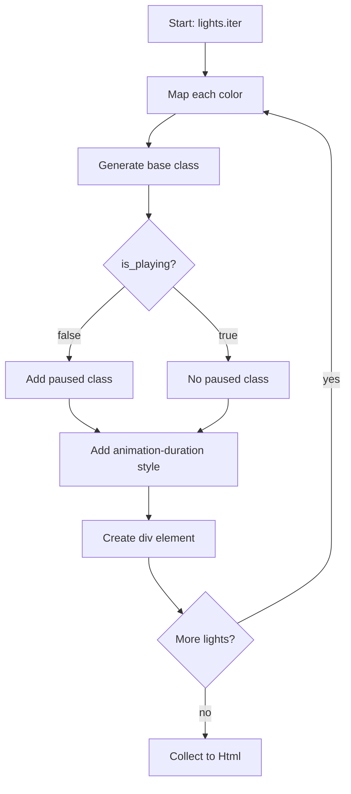
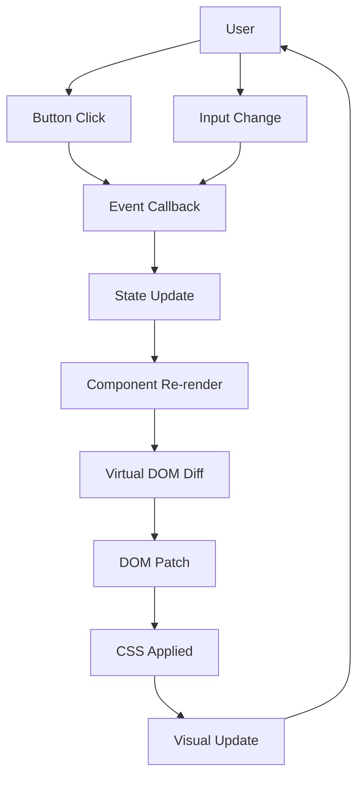

# Component Details

This page provides an in-depth look at each component, module, and function in the xmas-rs application.

## Table of Contents

- [LightColor Enum](#lightcolor-enum)
- [App Component](#app-component)
- [State Management](#state-management)
- [Event Handlers](#event-handlers)
- [Rendering Logic](#rendering-logic)
- [CSS Components](#css-components)

---

## LightColor Enum

**Location**: `src/main.rs` (lines 5-22)

### Purpose

Represents the four possible colors for Christmas lights in a type-safe manner.

### Definition

```rust
#[derive(Clone, PartialEq)]
enum LightColor {
    Red,
    Yellow,
    Blue,
    Green,
}
```

### Methods

#### `to_class(&self) -> &str`

Converts the enum variant to a CSS class name string.

**Returns**: A string slice representing the CSS class name

**Usage**:
```rust
let color = LightColor::Red;
let class_name = color.to_class(); // Returns "red"
```

### Traits

- **Clone**: Allows creating copies of `LightColor` values
- **PartialEq**: Enables equality comparison between `LightColor` values

### Design Rationale

Using an enum instead of strings provides:
- Compile-time type safety
- Exhaustive match checking
- Better IDE support and autocomplete
- Prevention of typos in color names

---

## App Component

**Location**: `src/main.rs` (lines 24-123)

### Purpose

The main and only component of the application. Manages all application state, handles user interactions, and renders the complete UI.

### Component Type

Function Component (using `#[function_component(App)]` macro)

### Structure Diagram



### Lifecycle



---

## State Management

The App component manages three pieces of state:

### 1. is_playing

**Type**: `UseStateHandle<bool>`
**Initial Value**: `true`
**Purpose**: Controls whether the lights animation is active

**State Transitions**:


**Effects**:
- `true`: Lights animate normally
- `false`: "paused" CSS class added, stopping animation

### 2. speed

**Type**: `UseStateHandle<i32>`
**Initial Value**: `1`
**Purpose**: Controls animation speed (1-5)
**Valid Range**: 1 (slowest) to 5 (fastest)

**Speed Mappings**:

| Speed | Duration | Description |
|-------|----------|-------------|
| 1 | 2s | Very slow |
| 2 | 1.5s | Slow |
| 3 | 1s | Normal |
| 4 | 0.75s | Fast |
| 5 | 0.5s | Very fast |

### 3. speed_input_ref

**Type**: `UseNodeRefHandle`
**Purpose**: Reference to the speed input HTML element
**Usage**: Allows direct access to input value when RUN button is clicked

---

## Event Handlers

### on_play Callback

**Location**: `src/main.rs` (lines 42-47)

**Purpose**: Resumes the lights animation

**Implementation**:
```rust
let on_play = {
    let is_playing = is_playing.clone();
    Callback::from(move |_| {
        is_playing.set(true);
    })
};
```

**Flow**:


### on_stop Callback

**Location**: `src/main.rs` (lines 49-54)

**Purpose**: Pauses the lights animation

**Implementation**:
```rust
let on_stop = {
    let is_playing = is_playing.clone();
    Callback::from(move |_| {
        is_playing.set(false);
    })
};
```

**Flow**:


### on_speed_change Callback

**Location**: `src/main.rs` (lines 56-69)

**Purpose**: Updates animation speed based on user input

**Implementation**:
```rust
let on_speed_change = {
    let speed = speed.clone();
    let speed_input_ref = speed_input_ref.clone();
    Callback::from(move |e: MouseEvent| {
        e.prevent_default();
        if let Some(input) = speed_input_ref.cast::<HtmlInputElement>() {
            if let Ok(value) = input.value().parse::<i32>() {
                if (1..=5).contains(&value) {
                    speed.set(value);
                }
            }
        }
    })
};
```

**Flow**:


**Validation Steps**:
1. Prevent default form submission behavior
2. Cast node ref to `HtmlInputElement`
3. Parse input value as `i32`
4. Validate range (1-5)
5. Update state only if all checks pass

---

## Rendering Logic

### Lights Array

**Location**: `src/main.rs` (lines 30-40)

**Definition**:
```rust
let lights = vec![
    LightColor::Red,
    LightColor::Yellow,
    LightColor::Blue,
    LightColor::Green,
    LightColor::Red,
    LightColor::Yellow,
    LightColor::Blue,
    LightColor::Green,
];
```

**Pattern**: Repeating sequence of 4 colors, creating 8 total lights

### Animation Duration Calculation

**Location**: `src/main.rs` (lines 71-79)

**Logic**:
```rust
let animation_duration = match *speed {
    1 => "2s",
    2 => "1.5s",
    3 => "1s",
    4 => "0.75s",
    5 => "0.5s",
    _ => "1s",
};
```

**Fallback**: Default to "1s" for any unexpected value

### Lights Rendering

**Location**: `src/main.rs` (lines 84-94)

**Process**:


**Generated HTML Structure**:
```html
<div class="circle red" style="animation-duration: 1s"></div>
<div class="circle yellow" style="animation-duration: 1s"></div>
<div class="circle blue" style="animation-duration: 1s"></div>
<div class="circle green" style="animation-duration: 1s"></div>
<!-- ... 4 more lights -->
```

### Controls Rendering

**Location**: `src/main.rs` (lines 96-120)

**Structure**:
```
div.utilities
├── div.title
│   └── h1#title: "Christmas Lights"
└── div.buttons
    ├── button#play (onclick: on_play): "On"
    ├── button#stop (onclick: on_stop): "Off"
    ├── label: "Speed:"
    ├── input#quantity (type: number, min: 1, max: 5)
    └── input#submit (type: submit, value: "RUN")
```

---

## CSS Components

**Location**: `styles.css`

### Key CSS Classes

#### .circle

Base class for all light elements

**Properties**:
- `width: 50px`
- `height: 50px`
- `border-radius: 50%` (makes it circular)
- `animation: blink 1s infinite`

#### Color Classes

**.circle.red**
```css
background: #ff0000;
box-shadow: 0 0 20px #ff0000;
animation-delay: 0s;
```

**.circle.yellow**
```css
background: #ffff00;
box-shadow: 0 0 20px #ffff00;
animation-delay: 0.25s;
```

**.circle.blue**
```css
background: #0000ff;
box-shadow: 0 0 20px #0000ff;
animation-delay: 0.5s;
```

**.circle.green**
```css
background: #00ff00;
box-shadow: 0 0 20px #00ff00;
animation-delay: 0.75s;
```

#### .paused

Applied when animation is stopped

```css
.paused {
  animation-play-state: paused !important;
  background: #563260 !important;
  box-shadow: none !important;
}
```

### Animation Keyframes

#### @keyframes blink

```css
@keyframes blink {
  0%, 49% {
    opacity: 1;
    transform: scale(1);
  }
  50%, 100% {
    opacity: 0.3;
    transform: scale(0.9);
  }
}
```

**Effect**: Creates a blinking effect by:
1. Full brightness and size for first half
2. Dim and slightly smaller for second half

#### @keyframes titleBlink

```css
@keyframes titleBlink {
  0%, 50% {
    color: #fff;
  }
  51%, 100% {
    color: #ff0000;
  }
}
```

**Effect**: Alternates title color between white and red

---

## Component Interaction Summary



---

**Related Pages**:
- [[Architecture]] - High-level system architecture
- [[Build-and-Deployment]] - Build and deployment process
- [[Home]] - Wiki home page
